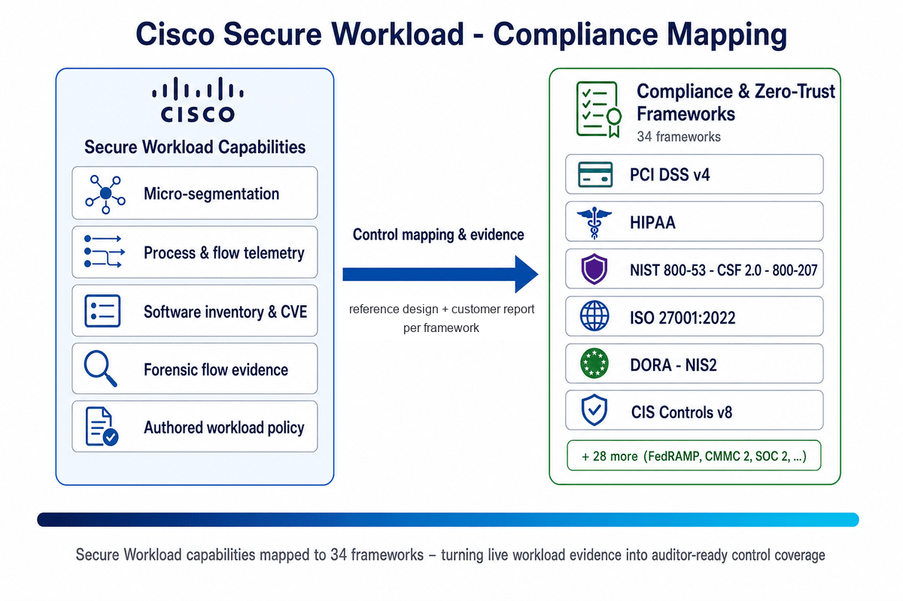

# Cisco Secure Workload — Compliance Reference Designs & Reports

Customer-facing reports and matching **reference designs** that map Cisco
Secure Workload (CSW) controls to **thirty-four** compliance, sector, and
zero-trust frameworks. Every framework folder ships the same set of
assets: a Markdown **reference design** (the engineering view — architecture
intent, configuration steps, sample policies, and the exact evidence
exports), a DOCX report (the editable customer master), a PDF render of
that report, and HTML versions of both for browser/mobile reading.

> **New here?** Read [Background — What is Cisco Secure Workload?](./docs/about-csw.md)
> for a one-page intro to the platform itself, then come back to pick a
> framework.

## Executive overview — 60-second read

> **For a CISO / CIO skimming this for the first time.**

- **What this is.** A reference library that maps Cisco Secure Workload
  (CSW) capabilities to **34 security, regulatory, and zero-trust
  frameworks** — so you can see *which* controls CSW helps you evidence,
  and *how*, before committing budget or audit hours.
- **What you get per framework.** Two paired documents — a **reference
  design** (the engineering view: architecture intent, configuration
  steps, sample policies, and the exact evidence exports) and a
  **customer-facing report** (the assessor-ready narrative built on that
  work) — each in Markdown, DOCX, PDF, and HTML. Each framework also has
  its own standalone [Reference Design repo](#per-framework-reference-designs)
  with a full CSW build guide, per-control evidence table, and POV plan.
- **The core idea.** CSW turns live workload behaviour — *who talks to
  whom, on which port, via which process, and what changed* — into
  micro-segmentation, drift tracking, and forensic-grade flow evidence.
  The same evidence answers the **auditor** ("prove the control still
  holds, not just on audit day") and the **incident responder** ("what
  moved laterally, and what changed"). That overlap is why segmentation
  shows up across PCI, HIPAA, NIST, DORA, NIS2, and the zero-trust models.
- **Where to start.** New to CSW → [compliance evidence
  playbook](./docs/compliance-evidence-playbook.md). Hunting a specific
  control → [`INDEX.md`](./INDEX.md). Choosing a framework → the
  [asset library](#asset-library) table below. Want one framework in its
  own shareable repo → the [per-framework reference
  designs](#per-framework-reference-designs) index.
- **Read this before relying on it.** These mappings are **informational
  reference only** — not legal, audit, or completeness advice. They
  require **SME review** against current official sources and your
  assessors. Note the explicitly-labelled drafts and proposals: **HIPAA
  2025 NPRM** is a *proposed* rule; **CIS / CSF 2.0 / CMMC 2.0** and
  **NERC CIP / TSA Pipeline** are *draft v1* cross-framework or
  IT-side sector overlays. See the full [Disclaimer](#disclaimer).

## Why these mappings exist

Compliance frameworks were written by humans trying to describe what
"good security" looks like for a class of risk. They are *outcomes*,
not products. The hardest question a customer faces is not *"what does
the standard require?"* — it's *"for the workloads I actually defend,
can I actually prove — with evidence that survives scrutiny — that the
control still holds tomorrow, not just on audit day?"*

These mappings exist to close that gap. For each framework, they trace
specific controls (e.g. PCI DSS Req 1.2.1, HIPAA §164.312(a)(1), NIST
AC-4) to concrete CSW capabilities — micro-segmentation, process-level
telemetry, software inventory, vulnerability awareness, forensic flow
data, and authored workload policy — and explain how those capabilities
can contribute evidence for assessor review when deployed in scope.

The same workload-resident evidence that can support an auditor's review also
shortens the questions defenders ask under pressure: *what was talking
to what, on which port, via which process, and what changed?* That
overlap is not a coincidence — it's why segmentation, lateral-movement
visibility, and patching priority show up across PCI Req 1, HIPAA
§164.312, NIST AC-4, ISO A.8.22, DORA Art. 9, NIS2 Art. 21(2)(j) and the
zero-trust frameworks. Standards writers captured the failure modes
people keep living through; treating those obligations as audit
busywork forfeits blast-radius containment while still paying for the
programme.

For the longer argument — including the five conversation-starter
questions worth walking through against your own environment — see
[Why these mappings matter](./docs/why-these-mappings-matter.md).

## How the mapping works

*The same Secure Workload capabilities — micro-segmentation, process & flow telemetry, software inventory & CVE awareness, forensic flow evidence, and authored workload policy — are mapped, control by control, to 34 compliance and zero-trust frameworks. Each framework folder pairs an engineering reference design with a customer-facing report so the same live evidence answers both the auditor and the incident responder.*

---

## Per-framework reference designs

Prefer a focused, shareable repo for a single framework? Every one of the
**34 frameworks** below now has its own standalone **Reference Design**
repo, built to the same template so an evaluator can pick up any one of
them and know exactly what they are looking at:

- a hero overview and a **coverage snapshot** — Direct / Supporting / Evidence Required;
- a **reference architecture** diagram and an **evidence-flow** diagram (rendered natively on GitHub);
- a **step-by-step CSW build** — scopes → ADM → Monitor → Simulate → Enforce;
- a **requirement-by-requirement evidence table** naming the exact CSW export per control;
- a **POV / validation plan** and an **evidence checklist**; and
- the customer-facing **compliance report** (PDF / DOCX / HTML) with official framework citations.

> This repository stays the **full library + umbrella index**; the
> per-framework repos are the lightweight front-ends you can hand to one
> customer, assessor, or evaluator. The coverage language is deliberately
> conservative — **Direct** evidence is still evidence, not a pass, and
> every design calls out where another control owner still has to file.

### Payments &amp; financial services
| Framework | What you build &amp; evidence |
|---|---|
| [PCI DSS v4.0](https://github.com/chandrapati/CSW-PCI-DSS-Reference-Design) | CDE segmentation simulate→enforce, plus Req 1/11 evidence inputs to validate with your QSA |
| [SOC 2 Type II](https://github.com/chandrapati/CSW-SOC2-Reference-Design) | Continuous CC6/CC7 operating-effectiveness evidence instead of point-in-time samples |
| [DORA (EU 2022/2554)](https://github.com/chandrapati/CSW-DORA-Reference-Design) | Art. 8/9 segmentation &amp; inventory and Art. 19 ICT-incident dossiers for EU financial entities |
| [NY DFS Part 500](https://github.com/chandrapati/CSW-NYDFS-Reference-Design) | Covered-system segmentation, NPI scope, and third-party egress evidence |
| [MAS TRM](https://github.com/chandrapati/CSW-MAS-TRM-Reference-Design) | Singapore critical-system segmentation, outsourcing egress, and incident support |
| [APRA CPS 234](https://github.com/chandrapati/CSW-APRA-CPS234-Reference-Design) | Critical information-asset segmentation and control-testing evidence |
| [SWIFT CSCF](https://github.com/chandrapati/CSW-SWIFT-CSCF-Reference-Design) | Secure-zone isolation, operator-session integrity, and mandatory-control mapping |

### Healthcare
| Framework | What you build &amp; evidence |
|---|---|
| [HIPAA Security Rule](https://github.com/chandrapati/CSW-HIPAA-Reference-Design) | ePHI workload isolation and §164.312 technical-safeguard evidence |
| [HIPAA 2025 NPRM](https://github.com/chandrapati/CSW-HIPAA-NPRM-Reference-Design) | *Proposed* mandatory segmentation, asset inventory, and breach-timeline design |
| [HITRUST CSF v11](https://github.com/chandrapati/CSW-HITRUST-Reference-Design) | Harmonized HIPAA+ISO+NIST+PCI control evidence for e1 / i1 / r2 |

### US federal &amp; defense
| Framework | What you build &amp; evidence |
|---|---|
| [NIST SP 800-53 Rev 5](https://github.com/chandrapati/CSW-NIST-800-53-Reference-Design) | AC-4 flow enforcement, CA-7 continuous monitoring, CM baseline/change evidence |
| [NIST SP 800-171 Rev 3](https://github.com/chandrapati/CSW-NIST-800-171-Reference-Design) | CUI enclave isolation and 03.13 flow control underpinning CMMC Level 2 |
| [FedRAMP (Moderate)](https://github.com/chandrapati/CSW-FedRAMP-Reference-Design) | ConMon evidence and POA&amp;M inputs on the 800-53 Moderate baseline |
| [CMMC 2.0](https://github.com/chandrapati/CSW-CMMC-Reference-Design) | Level-2 CUI-scope segmentation and AC/AU/CM/SC/SI evidence |
| [FIPS 140](https://github.com/chandrapati/CSW-FIPS-Reference-Design) | Plaintext-protocol DENY enforcement and programme-level crypto-posture visibility |

### Zero trust
| Framework | What you build &amp; evidence |
|---|---|
| [CISA Zero Trust Maturity Model](https://github.com/chandrapati/CSW-CISA-ZTMM-Reference-Design) | Networks and Applications &amp; Workloads pillar Initial→Advanced maturity path |
| [NIST SP 800-207](https://github.com/chandrapati/CSW-NIST-800-207-Reference-Design) | Workload-side evidence for ZTA tenets 2/3/5/6 and PEP placement |
| [NIST SP 800-207A](https://github.com/chandrapati/CSW-NIST-800-207A-Reference-Design) | CSW as PDP/PEP/PIP mapping for cloud-native ZTA components |

### Cloud assurance
| Framework | What you build &amp; evidence |
|---|---|
| [ISO/IEC 27001:2022](https://github.com/chandrapati/CSW-ISO27001-Reference-Design) | A.8.20–A.8.22 segregation and A.8.16 monitoring evidence |
| [CSA CCM v4](https://github.com/chandrapati/CSW-CSA-CCM-Reference-Design) | Cloud workload segmentation and IVS/DSP isolation for STAR |
| [BSI C5](https://github.com/chandrapati/CSW-BSI-C5-Reference-Design) | Tenant / shared-service boundaries and incident evidence for cloud providers |

### Industrial &amp; OT (IT-side)
| Framework | What you build &amp; evidence |
|---|---|
| [IEC 62443 (IACS)](https://github.com/chandrapati/CSW-IEC62443-Reference-Design) | Zones &amp; conduits segmentation on the IT side of the IACS boundary |
| [NIST SP 800-82](https://github.com/chandrapati/CSW-NIST-800-82-Reference-Design) | OT-adjacent IT segmentation — jump hosts, historians, vendor access |
| [NERC CIP](https://github.com/chandrapati/CSW-NERC-CIP-Reference-Design) | IT-side ESP/EACMS hardening plus ports / baseline / VA evidence (BES) |
| [TSA Pipeline](https://github.com/chandrapati/CSW-TSA-Pipeline-Reference-Design) | IT-side IT/OT segmentation and CIRP / CAP evidence packs |

### Governance &amp; cross-framework
| Framework | What you build &amp; evidence |
|---|---|
| [NIST CSF 2.0](https://github.com/chandrapati/CSW-CSF-Reference-Design) | Govern plus ID / PR / DE / RS Subcategory evidence pack |
| [CIS Controls v8.1](https://github.com/chandrapati/CSW-CIS-Reference-Design) | Direct on Controls 1/2/4/7/8/13 with IG1→IG3 deltas |
| [COBIT 2019](https://github.com/chandrapati/CSW-COBIT-Reference-Design) | DSS05 / APO13 / MEA conformance and change/config evidence |
| [MITRE ATT&amp;CK (Enterprise)](https://github.com/chandrapati/CSW-MITRE-ATTACK-Reference-Design) | Tactic-by-tactic detection/prevention mapping and SOC integration |

### Regional &amp; sector
| Framework | What you build &amp; evidence |
|---|---|
| [GDPR (EU 2016/679)](https://github.com/chandrapati/CSW-GDPR-Reference-Design) | Art. 32 security-of-processing, Art. 30 data-flow, Art. 33/34 breach timeline |
| [NIS2 (EU 2022/2555)](https://github.com/chandrapati/CSW-NIS2-Reference-Design) | Art. 21(2) risk-management and Art. 23 24h/72h/1-month incident dossier |
| [Australian Essential Eight](https://github.com/chandrapati/CSW-Essential-Eight-Reference-Design) | ML1–ML3 maturity and patch prioritisation via CVE + EPSS |
| [UK Cyber Essentials Plus](https://github.com/chandrapati/CSW-Cyber-Essentials-Reference-Design) | Workload firewall, secure configuration, and patch evidence |
| [TISAX / VDA ISA](https://github.com/chandrapati/CSW-TISAX-Reference-Design) | Automotive prototype / engineering workload segmentation and supplier egress |

## Customer design aids

| Asset | Use it for | Formats |
|---|---|---|
| **Compliance evidence playbook** | Step-by-step CSW operations for newcomers — coverage, ADM, simulation, enforce, quarterly export pack | [MD](./docs/compliance-evidence-playbook.md) · [PDF](./docs/compliance-evidence-playbook.pdf) · [DOCX](./docs/compliance-evidence-playbook.docx) · [HTML](./docs/compliance-evidence-playbook.html) |
| Framework Scope Design Guide | Translating each compliance framework into practical CSW scope patterns, customer workshop questions, and label/tag recommendations | [MD](./docs/framework-scope-design.md) · [PDF](./docs/framework-scope-design.pdf) |
| **SE compliance & cyber-insurance role-play** | A first discovery-conversation rehearsal aid for SEs/SAs and partners — open by asking compliance needs, map pain to CSW, frame in the customer's framework, and answer the cyber-insurance / ransomware supplemental control questions honestly (what CSW covers vs. what to pair) | [MD](./docs/se-compliance-cyber-insurance-roleplay.md) · [PDF](./docs/se-compliance-cyber-insurance-roleplay.pdf) · [DOCX](./docs/se-compliance-cyber-insurance-roleplay.docx) · [HTML](./docs/se-compliance-cyber-insurance-roleplay.html) |
| Governance and Evidence Standards | Control applicability, shared responsibility, evidence integrity, export handling, exceptions, and mapping lifecycle | [MD](./docs/governance-and-evidence-standards.md) |
| Evidence Package Manifest | Capturing scope, collection provenance, classification, integrity checks, limitations, and exceptions for customer evidence packages | [YAML](./templates/evidence-package-manifest.yaml) |

## Governance baseline

These assets are **evidence mappings**, not compliance attestations. Use the
[Governance and Evidence Standards](./docs/governance-and-evidence-standards.md)
to record whether CSW makes a direct or supporting evidence contribution,
where complementary controls are required, and which party owns each control.
Customer-specific exports, credentials, raw diagnostic bundles, and unredacted
evidence belong in the customer-approved evidence system—not in this repository.

The library contains both legacy hand-authored reports and generated report
assets. Treat every customer-facing artifact as **draft unless marked
SME-reviewed** for the applicable framework edition, CSW release, deployment
scope, and shared-responsibility model.

## Asset library

**Coverage** highlights what each framework section addresses so the
whole library can be scanned in one view. The **Reference design** column
comes first because the reference design is what proves the mapping is real
and not marketing — it shows the actual architecture intent, configuration
steps, sample policies, and evidence collection. The **Report** column is the
customer-facing narrative built on top of that work. Format links open the
asset directly; pick whichever fits the conversation you're in (see the
[audience and usage guide](./docs/audience-and-usage.md) for when to
reach for the reference design vs. the report).

| Framework | Coverage | Reference design | Report |
|---|---|---|---|
| HIPAA Security Rule | ePHI workload isolation; investigation-supporting telemetry; BAA technical boundary evidence | [MD](./HIPAA/CSW-HIPAA-Reference-Design.md) · [PDF](./HIPAA/CSW-HIPAA-Reference-Design.pdf) · [DOCX](./HIPAA/CSW-HIPAA-Reference-Design.docx) · [HTML](./HIPAA/CSW-HIPAA-Reference-Design.html) | [PDF](./HIPAA/CSW-HIPAA-Compliance-Report.pdf) · [DOCX](./HIPAA/CSW-HIPAA-Compliance-Report.docx) · [HTML](./HIPAA/CSW-HIPAA-Compliance-Report.html) |
| SOC 2 Type II | Continuous CC6.x evidence (vs point-in-time samples); CC7 incident artefacts; customer due-diligence proofs | [MD](./SOC2/CSW-SOC2-Reference-Design.md) · [PDF](./SOC2/CSW-SOC2-Reference-Design.pdf) · [DOCX](./SOC2/CSW-SOC2-Reference-Design.docx) · [HTML](./SOC2/CSW-SOC2-Reference-Design.html) | [PDF](./SOC2/CSW-SOC2-Compliance-Report.pdf) · [DOCX](./SOC2/CSW-SOC2-Compliance-Report.docx) · [HTML](./SOC2/CSW-SOC2-Compliance-Report.html) |
| PCI DSS v4.0 | CDE segmentation simulation→enforce; Req 1/11 evidence inputs to validate with your QSA; CVE + EPSS + reachability prioritisation | [MD](./PCI-DSS-v4/CSW-PCI-DSS-Reference-Design.md) · [PDF](./PCI-DSS-v4/CSW-PCI-DSS-Reference-Design.pdf) · [DOCX](./PCI-DSS-v4/CSW-PCI-DSS-Reference-Design.docx) · [HTML](./PCI-DSS-v4/CSW-PCI-DSS-Reference-Design.html) | [PDF](./PCI-DSS-v4/CSW-PCI-DSS-Compliance-Report.pdf) · [DOCX](./PCI-DSS-v4/CSW-PCI-DSS-Compliance-Report.docx) · [HTML](./PCI-DSS-v4/CSW-PCI-DSS-Compliance-Report.html) |
| NIST SP 800-53 Rev 5 | AC-4 information-flow enforcement; CA-7 continuous monitoring; CM-2/3/8 baseline + change tracking | [MD](./NIST-800-53/CSW-NIST-800-53-Reference-Design.md) · [PDF](./NIST-800-53/CSW-NIST-800-53-Reference-Design.pdf) · [DOCX](./NIST-800-53/CSW-NIST-800-53-Reference-Design.docx) · [HTML](./NIST-800-53/CSW-NIST-800-53-Reference-Design.html) | [PDF](./NIST-800-53/CSW-NIST-800-53-Compliance-Report.pdf) · [DOCX](./NIST-800-53/CSW-NIST-800-53-Compliance-Report.docx) · [HTML](./NIST-800-53/CSW-NIST-800-53-Compliance-Report.html) |
| ISO/IEC 27001:2022 | A.8.20–A.8.22 network segregation; A.5.19–A.5.22 supplier egress reconciliation; A.8.16 monitoring evidence | [MD](./ISO-27001-2022/CSW-ISO27001-Reference-Design.md) · [PDF](./ISO-27001-2022/CSW-ISO27001-Reference-Design.pdf) · [DOCX](./ISO-27001-2022/CSW-ISO27001-Reference-Design.docx) · [HTML](./ISO-27001-2022/CSW-ISO27001-Reference-Design.html) | [PDF](./ISO-27001-2022/CSW-ISO27001-Compliance-Report.pdf) · [DOCX](./ISO-27001-2022/CSW-ISO27001-Compliance-Report.docx) · [HTML](./ISO-27001-2022/CSW-ISO27001-Compliance-Report.html) |
| CISA Zero Trust Maturity Model | Networks pillar Initial→Advanced path; Applications & Workloads policy enforcement; observable maturity progression | [MD](./CISA-ZeroTrust/CSW-CISA-ZTMM-Reference-Design.md) · [PDF](./CISA-ZeroTrust/CSW-CISA-ZTMM-Reference-Design.pdf) · [DOCX](./CISA-ZeroTrust/CSW-CISA-ZTMM-Reference-Design.docx) · [HTML](./CISA-ZeroTrust/CSW-CISA-ZTMM-Reference-Design.html) | [PDF](./CISA-ZeroTrust/CSW-CISA-ZTMM-Compliance-Report.pdf) · [DOCX](./CISA-ZeroTrust/CSW-CISA-ZTMM-Compliance-Report.docx) · [HTML](./CISA-ZeroTrust/CSW-CISA-ZTMM-Compliance-Report.html) |
| FIPS 140 | Plaintext-protocol DENY enforcement; programme-level FIPS posture (cryptographic modules out of scope); 140-2→140-3 transition visibility | [MD](./FIPS-140/CSW-FIPS-Reference-Design.md) · [PDF](./FIPS-140/CSW-FIPS-Reference-Design.pdf) · [DOCX](./FIPS-140/CSW-FIPS-Reference-Design.docx) · [HTML](./FIPS-140/CSW-FIPS-Reference-Design.html) | [PDF](./FIPS-140/CSW-FIPS-Compliance-Report.pdf) · [DOCX](./FIPS-140/CSW-FIPS-Compliance-Report.docx) · [HTML](./FIPS-140/CSW-FIPS-Compliance-Report.html) |
| NIST SP 800-207 (ZTA Seven Tenets) | Workload-side evidence for Tenets 2/3/5/6; ZTA architecture mapping; workload-level enforcement as one possible PEP placement | [MD](./NIST-800-207/CSW-NIST-800-207-Reference-Design.md) · [PDF](./NIST-800-207/CSW-NIST-800-207-Reference-Design.pdf) · [DOCX](./NIST-800-207/CSW-NIST-800-207-Reference-Design.docx) · [HTML](./NIST-800-207/CSW-NIST-800-207-Reference-Design.html) | [PDF](./NIST-800-207/CSW-NIST-800-207-Compliance-Report.pdf) · [DOCX](./NIST-800-207/CSW-NIST-800-207-Compliance-Report.docx) · [HTML](./NIST-800-207/CSW-NIST-800-207-Compliance-Report.html) |
| NIST SP 800-207A (PDP/PEP/PA/PIP, draft-derived) | CSW Defend as PDP/PEP; telemetry as PIP; logical-component traceability for cloud-native ZTA | [MD](./NIST-800-207A/CSW-NIST-800-207A-Reference-Design.md) · [PDF](./NIST-800-207A/CSW-NIST-800-207A-Reference-Design.pdf) · [DOCX](./NIST-800-207A/CSW-NIST-800-207A-Reference-Design.docx) · [HTML](./NIST-800-207A/CSW-NIST-800-207A-Reference-Design.html) | [PDF](./NIST-800-207A/CSW-NIST-800-207A-Compliance-Report.pdf) · [DOCX](./NIST-800-207A/CSW-NIST-800-207A-Compliance-Report.docx) · [HTML](./NIST-800-207A/CSW-NIST-800-207A-Compliance-Report.html) |
| DORA (EU 2022/2554) | Art. 8/9 segmentation + inventory; Art. 19 incident dossier templates; Art. 28 third-party egress reconciliation | [MD](./DORA/CSW-DORA-Reference-Design.md) · [PDF](./DORA/CSW-DORA-Reference-Design.pdf) · [DOCX](./DORA/CSW-DORA-Reference-Design.docx) · [HTML](./DORA/CSW-DORA-Reference-Design.html) | [PDF](./DORA/CSW-DORA-Compliance-Report.pdf) · [DOCX](./DORA/CSW-DORA-Compliance-Report.docx) · [HTML](./DORA/CSW-DORA-Compliance-Report.html) |
| NIS2 (EU 2022/2555) | Art. 21(2)(a–j) risk-management mapping; Art. 23 24 h / 72 h / 1-month dossier; Art. 21(2)(d) supply-chain egress | [MD](./NIS2/CSW-NIS2-Reference-Design.md) · [PDF](./NIS2/CSW-NIS2-Reference-Design.pdf) · [DOCX](./NIS2/CSW-NIS2-Reference-Design.docx) · [HTML](./NIS2/CSW-NIS2-Reference-Design.html) | [PDF](./NIS2/CSW-NIS2-Compliance-Report.pdf) · [DOCX](./NIS2/CSW-NIS2-Compliance-Report.docx) · [HTML](./NIS2/CSW-NIS2-Compliance-Report.html) |
| NERC CIP (Bulk Electric System) | IT-side ESP boundary hardening (CIP-005 R1); IRA evidence (CIP-005 R2); CIP-007/010 ports + baseline + VA evidence; CIP-013 vendor-egress reconciliation. *IT-side scope; OT device layer out of scope.* | [MD](./NERC-CIP/CSW-NERC-CIP-Reference-Design.md) · [PDF](./NERC-CIP/CSW-NERC-CIP-Reference-Design.pdf) · [DOCX](./NERC-CIP/CSW-NERC-CIP-Reference-Design.docx) · [HTML](./NERC-CIP/CSW-NERC-CIP-Reference-Design.html) | [PDF](./NERC-CIP/CSW-NERC-CIP-Compliance-Report.pdf) · [DOCX](./NERC-CIP/CSW-NERC-CIP-Compliance-Report.docx) · [HTML](./NERC-CIP/CSW-NERC-CIP-Compliance-Report.html) |
| TSA Pipeline Security Directive | IT-side IT/OT segmentation (Section III.A); access control + monitoring (III.B/III.C); unpatched-system risk reduction (III.D); CIRP + CAP evidence packs. *IT-side scope; OT device layer out of scope.* | [MD](./TSA-Pipeline/CSW-TSA-Pipeline-Reference-Design.md) · [PDF](./TSA-Pipeline/CSW-TSA-Pipeline-Reference-Design.pdf) · [DOCX](./TSA-Pipeline/CSW-TSA-Pipeline-Reference-Design.docx) · [HTML](./TSA-Pipeline/CSW-TSA-Pipeline-Reference-Design.html) | [PDF](./TSA-Pipeline/CSW-TSA-Pipeline-Compliance-Report.pdf) · [DOCX](./TSA-Pipeline/CSW-TSA-Pipeline-Compliance-Report.docx) · [HTML](./TSA-Pipeline/CSW-TSA-Pipeline-Compliance-Report.html) |
| CIS Critical Security Controls v8.1 | Direct on Controls 1, 2, 4, 7, 8, 13 (asset & software inventory, secure config, vuln mgmt, audit logs, network monitoring); IG2 lead with IG1/IG3 deltas called out | [MD](./CIS-Controls-v8/CSW-CIS-Reference-Design.md) · [PDF](./CIS-Controls-v8/CSW-CIS-Reference-Design.pdf) · [DOCX](./CIS-Controls-v8/CSW-CIS-Reference-Design.docx) · [HTML](./CIS-Controls-v8/CSW-CIS-Reference-Design.html) | [PDF](./CIS-Controls-v8/CSW-CIS-Compliance-Report.pdf) · [DOCX](./CIS-Controls-v8/CSW-CIS-Compliance-Report.docx) · [HTML](./CIS-Controls-v8/CSW-CIS-Compliance-Report.html) |
| NIST Cybersecurity Framework 2.0 | Govern (GV.OV/GV.SC) evidence pack; direct coverage of ID.AM, ID.RA, PR.IR, PR.PS, DE.CM, DE.AE, RS.AN, RS.MI Subcategories | [MD](./NIST-CSF-2/CSW-CSF-Reference-Design.md) · [PDF](./NIST-CSF-2/CSW-CSF-Reference-Design.pdf) · [DOCX](./NIST-CSF-2/CSW-CSF-Reference-Design.docx) · [HTML](./NIST-CSF-2/CSW-CSF-Reference-Design.html) | [PDF](./NIST-CSF-2/CSW-CSF-Compliance-Report.pdf) · [DOCX](./NIST-CSF-2/CSW-CSF-Compliance-Report.docx) · [HTML](./NIST-CSF-2/CSW-CSF-Compliance-Report.html) |
| CMMC 2.0 (DoD / DIB) | Level 2 lead (110 controls = NIST 800-171 Rev 2): direct on AC, AU, CM, RA, SC, SI families; CUI-scope labelling pattern; L1 (FCI) and L3 (800-172) deltas | [MD](./CMMC-2/CSW-CMMC-Reference-Design.md) · [PDF](./CMMC-2/CSW-CMMC-Reference-Design.pdf) · [DOCX](./CMMC-2/CSW-CMMC-Reference-Design.docx) · [HTML](./CMMC-2/CSW-CMMC-Reference-Design.html) | [PDF](./CMMC-2/CSW-CMMC-Compliance-Report.pdf) · [DOCX](./CMMC-2/CSW-CMMC-Compliance-Report.docx) · [HTML](./CMMC-2/CSW-CMMC-Compliance-Report.html) |
| IEC 62443 (IACS) | Zones & conduits segmentation; IT-side OT boundary hardening; SR control evidence; pair with Cyber Vision/Claroty for OT device layer | [MD](./IEC-62443/CSW-IEC62443-Reference-Design.md) · [PDF](./IEC-62443/CSW-IEC62443-Reference-Design.pdf) · [DOCX](./IEC-62443/CSW-IEC62443-Reference-Design.docx) · [HTML](./IEC-62443/CSW-IEC62443-Reference-Design.html) | [PDF](./IEC-62443/CSW-IEC62443-Compliance-Report.pdf) · [DOCX](./IEC-62443/CSW-IEC62443-Compliance-Report.docx) · [HTML](./IEC-62443/CSW-IEC62443-Compliance-Report.html) |
| GDPR (EU 2016/679) | Art. 32 security-of-processing evidence; data-flow mapping for Art. 30 RoPA; breach timeline for Art. 33/34; processor egress for Art. 28 | [MD](./GDPR/CSW-GDPR-Reference-Design.md) · [PDF](./GDPR/CSW-GDPR-Reference-Design.pdf) · [DOCX](./GDPR/CSW-GDPR-Reference-Design.docx) · [HTML](./GDPR/CSW-GDPR-Reference-Design.html) | [PDF](./GDPR/CSW-GDPR-Compliance-Report.pdf) · [DOCX](./GDPR/CSW-GDPR-Compliance-Report.docx) · [HTML](./GDPR/CSW-GDPR-Compliance-Report.html) |
| MITRE ATT&CK (Enterprise) | Tactic-by-tactic detection/prevention mapping (TA0001–TA0011, TA0040); technique-level forensic rule alignment; SOC integration guidance | [MD](./MITRE-ATTACK/CSW-MITRE-ATTACK-Reference-Design.md) · [PDF](./MITRE-ATTACK/CSW-MITRE-ATTACK-Reference-Design.pdf) · [DOCX](./MITRE-ATTACK/CSW-MITRE-ATTACK-Reference-Design.docx) · [HTML](./MITRE-ATTACK/CSW-MITRE-ATTACK-Reference-Design.html) | [PDF](./MITRE-ATTACK/CSW-MITRE-ATTACK-Compliance-Report.pdf) · [DOCX](./MITRE-ATTACK/CSW-MITRE-ATTACK-Compliance-Report.docx) · [HTML](./MITRE-ATTACK/CSW-MITRE-ATTACK-Compliance-Report.html) |
| FedRAMP (Moderate) | Moderate baseline overlay on NIST 800-53; ConMon evidence; POA&M inputs; 3PAO assessment preparation; AC-4/SC-7/CA-7/SI-4 FedRAMP parameters | [MD](./FedRAMP/CSW-FedRAMP-Reference-Design.md) · [PDF](./FedRAMP/CSW-FedRAMP-Reference-Design.pdf) · [DOCX](./FedRAMP/CSW-FedRAMP-Reference-Design.docx) · [HTML](./FedRAMP/CSW-FedRAMP-Reference-Design.html) | [PDF](./FedRAMP/CSW-FedRAMP-Compliance-Report.pdf) · [DOCX](./FedRAMP/CSW-FedRAMP-Compliance-Report.docx) · [HTML](./FedRAMP/CSW-FedRAMP-Compliance-Report.html) |
| SWIFT CSCF (v2024) | SWIFT secure zone isolation; mandatory/advisory control mapping; operator session integrity; Internet access restriction; SWIFT-specific logging | [MD](./SWIFT-CSCF/CSW-SWIFT-CSCF-Reference-Design.md) · [PDF](./SWIFT-CSCF/CSW-SWIFT-CSCF-Reference-Design.pdf) · [DOCX](./SWIFT-CSCF/CSW-SWIFT-CSCF-Reference-Design.docx) · [HTML](./SWIFT-CSCF/CSW-SWIFT-CSCF-Reference-Design.html) | [PDF](./SWIFT-CSCF/CSW-SWIFT-CSCF-Compliance-Report.pdf) · [DOCX](./SWIFT-CSCF/CSW-SWIFT-CSCF-Compliance-Report.docx) · [HTML](./SWIFT-CSCF/CSW-SWIFT-CSCF-Compliance-Report.html) |
| HITRUST CSF (v11) | Harmonized control mapping (HIPAA+ISO+NIST+PCI); e1/i1/r2 assessment level guidance; network segregation; vulnerability management; incident evidence | [MD](./HITRUST-CSF/CSW-HITRUST-Reference-Design.md) · [PDF](./HITRUST-CSF/CSW-HITRUST-Reference-Design.pdf) · [DOCX](./HITRUST-CSF/CSW-HITRUST-Reference-Design.docx) · [HTML](./HITRUST-CSF/CSW-HITRUST-Reference-Design.html) | [PDF](./HITRUST-CSF/CSW-HITRUST-Compliance-Report.pdf) · [DOCX](./HITRUST-CSF/CSW-HITRUST-Compliance-Report.docx) · [HTML](./HITRUST-CSF/CSW-HITRUST-Compliance-Report.html) |
| NIST SP 800-171 Rev. 3 | CUI enclave isolation; 03.01/03.13 flow enforcement; Rev 3 family alignment with 800-53; CMMC L2 underpinning evidence | [MD](./NIST-800-171/CSW-NIST-800-171-Reference-Design.md) · [PDF](./NIST-800-171/CSW-NIST-800-171-Reference-Design.pdf) · [DOCX](./NIST-800-171/CSW-NIST-800-171-Reference-Design.docx) · [HTML](./NIST-800-171/CSW-NIST-800-171-Reference-Design.html) | [PDF](./NIST-800-171/CSW-NIST-800-171-Compliance-Report.pdf) · [DOCX](./NIST-800-171/CSW-NIST-800-171-Compliance-Report.docx) · [HTML](./NIST-800-171/CSW-NIST-800-171-Compliance-Report.html) |
| CSA CCM v4 | Cloud workload segmentation; IVS-09 network security; DSP data isolation; TVM reachability; STAR certification evidence support | [MD](./CSA-CCM/CSW-CSA-CCM-Reference-Design.md) · [PDF](./CSA-CCM/CSW-CSA-CCM-Reference-Design.pdf) · [DOCX](./CSA-CCM/CSW-CSA-CCM-Reference-Design.docx) · [HTML](./CSA-CCM/CSW-CSA-CCM-Reference-Design.html) | [PDF](./CSA-CCM/CSW-CSA-CCM-Compliance-Report.pdf) · [DOCX](./CSA-CCM/CSW-CSA-CCM-Compliance-Report.docx) · [HTML](./CSA-CCM/CSW-CSA-CCM-Compliance-Report.html) |
| COBIT 2019 | DSS05.02 network security; APO13 managed security; MEA01/02 conformance monitoring; BAI06/10 change and configuration evidence | [MD](./COBIT-2019/CSW-COBIT-Reference-Design.md) · [PDF](./COBIT-2019/CSW-COBIT-Reference-Design.pdf) · [DOCX](./COBIT-2019/CSW-COBIT-Reference-Design.docx) · [HTML](./COBIT-2019/CSW-COBIT-Reference-Design.html) | [PDF](./COBIT-2019/CSW-COBIT-Compliance-Report.pdf) · [DOCX](./COBIT-2019/CSW-COBIT-Compliance-Report.docx) · [HTML](./COBIT-2019/CSW-COBIT-Compliance-Report.html) |
| Australian Essential Eight | ML1–ML3 maturity evidence; E2/E6 patch prioritisation via CVE+EPSS; E5 admin privilege path restriction; E1 application control support | [MD](./AU-Essential-Eight/CSW-Essential-Eight-Reference-Design.md) · [PDF](./AU-Essential-Eight/CSW-Essential-Eight-Reference-Design.pdf) · [DOCX](./AU-Essential-Eight/CSW-Essential-Eight-Reference-Design.docx) · [HTML](./AU-Essential-Eight/CSW-Essential-Eight-Reference-Design.html) | [PDF](./AU-Essential-Eight/CSW-Essential-Eight-Compliance-Report.pdf) · [DOCX](./AU-Essential-Eight/CSW-Essential-Eight-Compliance-Report.docx) · [HTML](./AU-Essential-Eight/CSW-Essential-Eight-Compliance-Report.html) |
| UK Cyber Essentials Plus | CE1 workload-level firewall; CE2 secure configuration baseline; CE5 patch management evidence; Plus technical verification support | [MD](./UK-Cyber-Essentials/CSW-Cyber-Essentials-Reference-Design.md) · [PDF](./UK-Cyber-Essentials/CSW-Cyber-Essentials-Reference-Design.pdf) · [DOCX](./UK-Cyber-Essentials/CSW-Cyber-Essentials-Reference-Design.docx) · [HTML](./UK-Cyber-Essentials/CSW-Cyber-Essentials-Reference-Design.html) | [PDF](./UK-Cyber-Essentials/CSW-Cyber-Essentials-Compliance-Report.pdf) · [DOCX](./UK-Cyber-Essentials/CSW-Cyber-Essentials-Compliance-Report.docx) · [HTML](./UK-Cyber-Essentials/CSW-Cyber-Essentials-Compliance-Report.html) |
| **UK NCSC CAF v3.2** | 14 principles for UK NIS OES and GovAssure. Direct evidence is B5.b segregation only; the other principles are supporting or out of scope. Draft v1 (Oct 2026) | [MD](./UK-NCSC-CAF/CSW-UK-NCSC-CAF-Reference-Design.md) · [Mapping](./UK-NCSC-CAF/caf-mapping.md) · [IGP scorer](./UK-NCSC-CAF/caf-igp-maturity-scorer.md) · [Evidence pack](./UK-NCSC-CAF/caf-evidence-pack-template.md) | [MD](./UK-NCSC-CAF/CSW-UK-NCSC-CAF-Compliance-Report.md) |
| HIPAA 2025 NPRM | Mandatory network segmentation (§164.312(a)(2)(vi)); technology asset inventory; 24-month log retention architecture; 72-hour breach timeline; annual assessment evidence | [MD](./HIPAA-2025-NPRM/CSW-HIPAA-NPRM-Reference-Design.md) · [PDF](./HIPAA-2025-NPRM/CSW-HIPAA-NPRM-Reference-Design.pdf) · [DOCX](./HIPAA-2025-NPRM/CSW-HIPAA-NPRM-Reference-Design.docx) · [HTML](./HIPAA-2025-NPRM/CSW-HIPAA-NPRM-Reference-Design.html) | [PDF](./HIPAA-2025-NPRM/CSW-HIPAA-NPRM-Compliance-Report.pdf) · [DOCX](./HIPAA-2025-NPRM/CSW-HIPAA-NPRM-Compliance-Report.docx) · [HTML](./HIPAA-2025-NPRM/CSW-HIPAA-NPRM-Compliance-Report.html) |
| MAS TRM | Singapore financial-sector technology risk evidence; critical-system segmentation; outsourcing / third-party egress; incident investigation support | [MD](./MAS-TRM/CSW-MAS-TRM-Reference-Design.md) · [PDF](./MAS-TRM/CSW-MAS-TRM-Reference-Design.pdf) · [DOCX](./MAS-TRM/CSW-MAS-TRM-Reference-Design.docx) · [HTML](./MAS-TRM/CSW-MAS-TRM-Reference-Design.html) | [PDF](./MAS-TRM/CSW-MAS-TRM-Compliance-Report.pdf) · [DOCX](./MAS-TRM/CSW-MAS-TRM-Compliance-Report.docx) · [HTML](./MAS-TRM/CSW-MAS-TRM-Compliance-Report.html) |
| APRA CPS 234 | Australian prudential information security; critical information assets; control testing; service-provider dependency visibility | [MD](./APRA-CPS-234/CSW-APRA-CPS234-Reference-Design.md) · [PDF](./APRA-CPS-234/CSW-APRA-CPS234-Reference-Design.pdf) · [DOCX](./APRA-CPS-234/CSW-APRA-CPS234-Reference-Design.docx) · [HTML](./APRA-CPS-234/CSW-APRA-CPS234-Reference-Design.html) | [PDF](./APRA-CPS-234/CSW-APRA-CPS234-Compliance-Report.pdf) · [DOCX](./APRA-CPS-234/CSW-APRA-CPS234-Compliance-Report.docx) · [HTML](./APRA-CPS-234/CSW-APRA-CPS234-Compliance-Report.html) |
| NY DFS 23 NYCRR Part 500 | Covered-system workload visibility; NPI application scope; vulnerability context; third-party service-provider egress; incident support | [MD](./NY-DFS-23-NYCRR-500/CSW-NYDFS-Reference-Design.md) · [PDF](./NY-DFS-23-NYCRR-500/CSW-NYDFS-Reference-Design.pdf) · [DOCX](./NY-DFS-23-NYCRR-500/CSW-NYDFS-Reference-Design.docx) · [HTML](./NY-DFS-23-NYCRR-500/CSW-NYDFS-Reference-Design.html) | [PDF](./NY-DFS-23-NYCRR-500/CSW-NYDFS-Compliance-Report.pdf) · [DOCX](./NY-DFS-23-NYCRR-500/CSW-NYDFS-Compliance-Report.docx) · [HTML](./NY-DFS-23-NYCRR-500/CSW-NYDFS-Compliance-Report.html) |
| TISAX / VDA ISA | Automotive prototype and confidential engineering workload segmentation; supplier/customer egress; assessment evidence support | [MD](./TISAX/CSW-TISAX-Reference-Design.md) · [PDF](./TISAX/CSW-TISAX-Reference-Design.pdf) · [DOCX](./TISAX/CSW-TISAX-Reference-Design.docx) · [HTML](./TISAX/CSW-TISAX-Reference-Design.html) | [PDF](./TISAX/CSW-TISAX-Compliance-Report.pdf) · [DOCX](./TISAX/CSW-TISAX-Compliance-Report.docx) · [HTML](./TISAX/CSW-TISAX-Compliance-Report.html) |
| NIST SP 800-82 | OT-adjacent IT segmentation; jump hosts, historians, patch repositories, identity services, vendor access; pair with OT visibility | [MD](./NIST-800-82/CSW-NIST-800-82-Reference-Design.md) · [PDF](./NIST-800-82/CSW-NIST-800-82-Reference-Design.pdf) · [DOCX](./NIST-800-82/CSW-NIST-800-82-Reference-Design.docx) · [HTML](./NIST-800-82/CSW-NIST-800-82-Reference-Design.html) | [PDF](./NIST-800-82/CSW-NIST-800-82-Compliance-Report.pdf) · [DOCX](./NIST-800-82/CSW-NIST-800-82-Compliance-Report.docx) · [HTML](./NIST-800-82/CSW-NIST-800-82-Compliance-Report.html) |
| BSI C5 | Cloud service assurance; tenant/shared-service workload boundaries; cloud communication security; vulnerability and incident evidence | [MD](./BSI-C5/CSW-BSI-C5-Reference-Design.md) · [PDF](./BSI-C5/CSW-BSI-C5-Reference-Design.pdf) · [DOCX](./BSI-C5/CSW-BSI-C5-Reference-Design.docx) · [HTML](./BSI-C5/CSW-BSI-C5-Reference-Design.html) | [PDF](./BSI-C5/CSW-BSI-C5-Compliance-Report.pdf) · [DOCX](./BSI-C5/CSW-BSI-C5-Compliance-Report.docx) · [HTML](./BSI-C5/CSW-BSI-C5-Compliance-Report.html) |

> **Quickly find a control?** See [`INDEX.md`](./INDEX.md) for a
> control-ID-keyed index across all thirty-five frameworks (e.g. *PCI Req
> 1.2*, *HIPAA §164.312(a)(1)*, *DORA Art. 9*, *NIS2 Art. 21(2)(d)*,
> *NIST AC-4*, *NERC CIP-005 R1*, *TSA SD Section III.A*, *IEC 62443 SR 5.3*,
> *GDPR Art. 32*, *FedRAMP AC-4*, *SWIFT CSCF 1.4*, *HITRUST 01.m*, *MITRE TA0008*,
> *CIS Safeguard 13.4*, *CSF PR.IR-01*, *CMMC AC.L2-3.1.1*, *NIST 800-171 03.13.06*,
> *CSA IVS-09*, *COBIT DSS05.02*, *E8 E5*, *UK CE1*, *HIPAA NPRM §164.312(a)(2)(vi)*,
> *MAS TRM*, *APRA CPS 234*, *NY DFS 500.03*, *TISAX ISA*, *NIST 800-82*, *BSI C5*).

> **Cross-cutting frameworks scope note (CIS, CSF, CMMC).** These three
> frameworks are *cross-mapping* / certification frameworks that
> intentionally overlap with the underlying NIST families already in
> this library. CIS Controls v8.1 is a prioritised subset of NIST
> 800-53; CSF 2.0 is an outcomes wrapper that cites 800-53 (and others)
> as Informative References; CMMC 2.0 Level 2 *is* NIST 800-171, which
> is itself a tailored subset of 800-53. Read the standalone reference design
> when you need the framework-native narrative (assessor language,
> IG/Level/Profile structure, format evidence comes in);
> cross-reference the [800-53](./NIST-800-53/) and
> [800-207](./NIST-800-207/) reference designs for the deeper control rationale.
> All three are **draft v1** and require SME review before being relied
> upon in a formal compliance engagement (CMMC L2 specifically requires
> a C3PAO assessment regardless).

> **Sector frameworks scope note (NERC CIP, TSA Pipeline).** Both
> frameworks are sector overlays whose substantive controls overlap
> heavily with the NIST families already in this library. The CSW
> mapping is on the **IT side** of the IT/OT boundary — EACMS, jump
> hosts, vendor-access servers, engineering workstations, historians,
> identity/PKI, and the corporate IT systems that touch BES Cyber
> System Information or pipeline Critical Cyber Systems. CSW does
> **not** enforce on PLCs/RTUs/IEDs/HMIs and is not certified as an
> Electronic Access Point (NERC) or as an OT-protocol DPI tool; pair
> with your boundary firewall and your OT-aware monitoring stack
> (Cisco Cyber Vision, Claroty, Nozomi, Dragos) for end-to-end
> coverage. Both reference designs and reports are **draft v1** and require SME
> review before being relied upon in a formal compliance engagement.

## Read next

- **[Analyst reading guide](./docs/analyst-reading-guide.md)** —
  how to walk each report and reference design with an analyst or reviewer,
  including what Direct, Supporting, and Evidence Required mean in the room.
- **[Compliance evidence playbook](./docs/compliance-evidence-playbook.md)** —
  **start here if you are new to CSW** — universal 4-phase evidence programme,
  console map, quarterly export pack, and CSW effectiveness vs. manual audits.
- **[Background — What is Cisco Secure Workload?](./docs/about-csw.md)** —
  one-page intro to the platform, its agent + connector model, and the
  ML capabilities relevant to this repository.
- **[Why these mappings matter](./docs/why-these-mappings-matter.md)** —
  five conversation-starter questions to ask about your own environment,
  plus the case for evaluating CSW alongside what you already run.
- **[Framework Scope Design Guide](./docs/framework-scope-design.md)** —
  customer workshop aid for translating framework obligations into CSW
  scopes, labels, and evidence boundaries.
- **[SE compliance & cyber-insurance role-play](./docs/se-compliance-cyber-insurance-roleplay.md)** —
  a discovery-conversation rehearsal aid: open by asking compliance needs,
  map pain to CSW, frame it in the customer's framework, and answer the
  cyber-insurance / ransomware supplemental honestly (what CSW covers vs.
  what to pair).
- **[Audience and usage guide](./docs/audience-and-usage.md)** — who
  should lead with which document, reference-design-vs-report guidance, file
  format guidance, and the full folder layout.
- **[`INDEX.md`](./INDEX.md)** — control-ID lookup across all thirty-five
  frameworks.
- **[CSW Epic EHR Microsegmentation Guide](https://github.com/chandrapati/CSW-Epic-Microsegmentation-Guide)** —
  step-by-step practitioner guide for Epic tier scopes, ADM, Interconnect/HL7
  policy, enforcement, and HIPAA quarterly evidence — pairs directly with the
  HIPAA and HITRUST reference designs in this repo.

Once GitHub Pages is enabled, the same content is also browseable at
`https://chandrapati.github.io/CSW-Compliance-Reference-Designs/` (landing page
[`index.html`](./index.html)).

## Licensing

This repository ships with Cisco's standard terms in
[`LICENSE`](./LICENSE) at the repo root — read before redistributing,
forking commercially, or building derivative artefacts outside your
organisation.

## Disclaimer

The compliance mappings in this repository are derived from public
standards and regulatory framework documents (HIPAA, SOC 2, PCI DSS,
NIST SP 800-series, ISO/IEC 27001, CISA ZTMM, FIPS 140, EU DORA,
EU NIS2, NERC CIP, TSA Pipeline Security Directives, CIS Critical
Security Controls v8.1, NIST Cybersecurity Framework 2.0, CMMC 2.0,
IEC 62443, GDPR, MITRE ATT&CK, FedRAMP, SWIFT CSCF, HITRUST CSF,
NIST SP 800-171 Rev. 3, CSA Cloud Controls Matrix v4, COBIT 2019,
ACSC Essential Eight, UK Cyber Essentials Plus, the HIPAA Security
Rule 2025 Notice of Proposed Rulemaking (NPRM), MAS Technology Risk
Management Guidelines, APRA CPS 234, NY DFS 23 NYCRR Part 500, TISAX /
VDA ISA, NIST SP 800-82, and BSI C5
cross-referenced against documented Cisco Secure Workload (CSW)
product capabilities at the time of authoring.

The **HIPAA 2025 NPRM** technical mapping interprets a **proposed**
Security Rule update and must be reconciled against **final** regulatory
text before formal reliance; continue parallel compliance with the
**current** Security Rule until amendments are effective.

The **NERC CIP** and **TSA Pipeline** mappings are explicitly scoped
to the **IT side of the IT/OT boundary** and are issued as **draft
v1**. Treat them as sector overlays on the underlying NIST family
rather than as standalone audit references.

The **CIS Controls v8.1**, **NIST CSF 2.0**, and **CMMC 2.0**
mappings are issued as **draft v1** and are *cross-mapping*
frameworks that intentionally overlap with the underlying NIST
families already in this library. CMMC Level 2 assessment is
performed by a Certified Third-Party Assessor Organisation (C3PAO);
nothing in this repository substitutes for the System Security Plan
(SSP), Plan of Action & Milestones (POA&M), or the C3PAO engagement.

All mappings require subject-matter-expert review for both
regulatory / framework accuracy and current Cisco product capability
before being relied upon in a formal compliance engagement.

These materials are provided for **informational and reference purposes
only**. They do not constitute legal, regulatory, or audit advice, are
not warranted to be complete, current, or fit for any specific
compliance program, and should not be relied upon as a substitute for
review by your own qualified compliance, legal, and audit professionals.

Standards evolve, product capabilities change, and the applicability of
any specific control depends on each organization's environment,
deployment, and risk posture. Always validate against the latest
official source documents before formal use.

**Guidelines.** The capability bullets in
[Background — What is Cisco Secure Workload?](./docs/about-csw.md)
describe how teams commonly use Cisco Secure Workload. They are not a
completeness check for your estate — apply professional judgment, align
with your assessors, and tailor to how you run operations.

For questions, scoping discussions, or to validate how these mappings
apply to your environment, please contact your **Cisco account team**.

---

## Step-by-Step Guides

> **Legend:** 🎬 video · 📘 guide · 📄 doc

Hands-on integration and deployment guides — follow these top to bottom to build out a deployment:

| Guide | Description | Best for |
|-------|-------------|---------|
| [📘 Agent Installation](https://github.com/chandrapati/CSW-Agent-Installation-Guide) | Deploy CSW agents on Linux / Windows / cloud | Day-1 sensor deployment |
| [📘 Policy Lifecycle](https://github.com/chandrapati/CSW-Policy-Lifecycle) | Policy discovery → enforcement workflow | Policy management |
| [📘 ISE / pxGrid](https://github.com/chandrapati/csw-ise-integration) | ISE/pxGrid: user-identity–aware microsegmentation | Identity & Zero Trust |
| [📘 AnyConnect NVM](https://github.com/chandrapati/csw-anyconnect-nvm) | Endpoint process flows + user identity via NVM | Endpoint telemetry |
| [📘 ServiceNow CMDB](https://github.com/chandrapati/csw-servicenow-integration) | ServiceNow CMDB label enrichment for workload scopes | CMDB-driven policy |
| [📘 Infoblox](https://github.com/chandrapati/csw-infoblox-integration) | Infoblox IPAM/DNS extensible-attribute label enrichment | IPAM/DNS-driven policy |
| [📘 F5 BIG-IP](https://github.com/chandrapati/csw-f5-integration) | F5 virtual-server labels, policy enforcement, IPFIX flow visibility | Load balancer segmentation |
| [📘 NetScaler ADC](https://github.com/chandrapati/csw-netscaler-integration) | NetScaler LB virtual-server labels, ACL enforcement + AppFlow/IPFIX flow visibility | Load balancer segmentation |
| [📘 AWS Connector](https://github.com/chandrapati/csw-aws-connector) | EC2 tag ingestion + VPC flow logs + Security Group enforcement | AWS workloads |
| [📘 Azure Connector](https://github.com/chandrapati/csw-azure-connector) | Azure VM tag ingestion + VNet flow logs + NSG enforcement | Azure workloads |
| [📘 GCP Connector](https://github.com/chandrapati/csw-gcp-connector) | GCE label ingestion + VPC flow logs + firewall enforcement | GCP workloads |
| [📘 NetFlow](https://github.com/chandrapati/csw-netflow-integration) | NetFlow v9/IPFIX agentless flow ingestion from switches | Network fabric visibility |
| [📘 ERSPAN](https://github.com/chandrapati/csw-erspan-integration) | Agentless packet mirroring for legacy / OT / IoT devices | Deep agentless visibility |
| [📘 Secure Firewall](https://github.com/chandrapati/CSW-Secure-Firewall-Integration-Guide) | NSEL flow ingestion from Cisco Secure Firewall (FTD/ASA) | Firewall flow visibility |
| [📘 Splunk Integration](https://github.com/chandrapati/csw-splunk-integration) | CSW syslog alerts → Splunk SIEM | SecOps / SIEM teams |

## Resources

> **Legend:** 🎬 video · 📘 guide · 📄 doc

Learning paths, reference material, and day-2 tooling:

| Resource | Description | Best for |
|----------|-------------|---------|
| [📘 User Education](https://github.com/chandrapati/CSW-User-Education) | Onboarding guides, concept explainers, and curated video library | New CSW users |
| [📘 Compliance Reference Designs](https://github.com/chandrapati/CSW-Compliance-Reference-Designs) | Reference designs + assessor-ready reports mapping CSW to 34 frameworks | Compliance & audit |
| [📘 Tenant Insights](https://github.com/chandrapati/CSW-Tenant-Insights) | Tenant-level reporting and analytics | Visibility metrics |
| [📘 Operations Toolkit](https://github.com/chandrapati/CSW-Operations-Toolkit) | Day-2 ops scripts: health checks, reporting, policy analysis | Ongoing operations |
| [📄 Supported OS & Compatibility Matrix](https://www.cisco.com/c/m/en_us/products/security/secure-workload-compatibility-matrix.html) | Cisco's authoritative list of supported agent operating systems, external systems, and connector requirements | Platform planning & prerequisites |

> **Suggested customer journey:**
> User Education → Agent Installation → Policy Lifecycle → ISE/pxGrid → ServiceNow CMDB → Infoblox → F5 BIG-IP → NetScaler ADC → Splunk Integration → Compliance Mapping → Operations Toolkit
